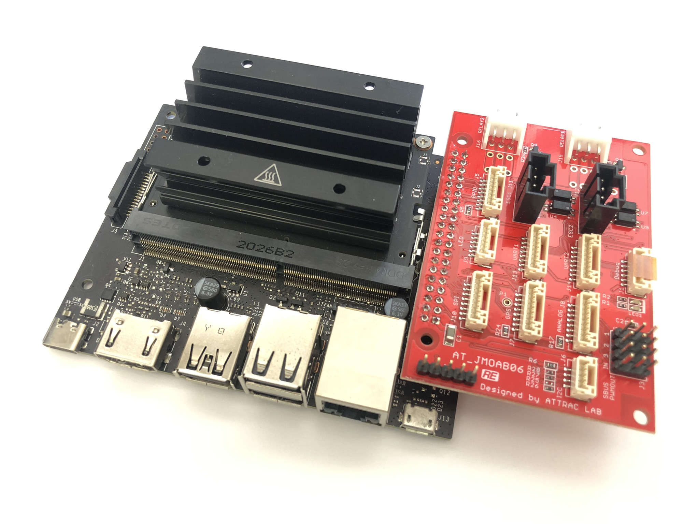
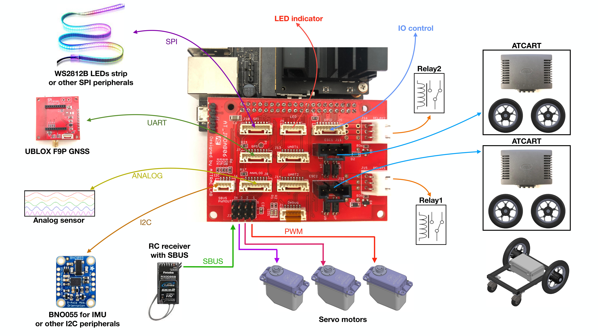

# JMOAB ROS2

JMOAB package for ROS2. This package is based on [jmoab-ros](https://github.com/rasheeddo/jmoab-ros) package from ROS1. The supported version of PCB is AT_JMOAB06.

## Dependencies

- ros2 debian packages, install from [here](https://docs.ros.org/en/foxy/Installation/Ubuntu-Install-Debians.html).
- `sudo pip3 install smbus2`
- `sudo apt install ros-$ROSDISTRO-tf-transformations`
- `sudo pip3 install transforms3d`
- `sudo pip3 install numpy`

Make sure to source all ros environment setup files.

`source /opt/ros/foxy/setup.bash` for Foxy.

`source ~/dev_ws/install/local_setup.bash` for local workspace name `dev_ws`.

## ATCart

To use JMOAB with ATCart, make sure to have the correct ESC FW by checking from [here](https://github.com/rasheeddo/BrushlessDriveWheels/tree/new-batch-esc#hack-new-batch-esc). The "Model" at the back of ESC should be "MN1 WSDC/3+7F&G-X". 

If you don't know what ATCart is, I recommend to check on [this site](https://stepbystep-robotics.com/hp/robots/atcart-overview/atcart-basic/) or [this video](https://www.youtube.com/watch?v=Y4HL69gDDOU&ab_channel=stepbystep-robotics) about how I hacked it and use it for robots project.

JMOAB itself can be connected with many peripherals,

You just need to run

`ros2 run jmoab_ros2 atcart_basic`

### publish

- `/jmoab/sbus_rc_ch` as std_msgs/msg/Int16MultiArray, sbus value of RC transmitter's channels
- `/jmoab/cart_mode` as std_msgs/msg/UInt8, 0: hold, 1: manual, 2: auto modes
- `/jmoab/adc` as std_msgs/msg/Float32MultiArray, ADC value in 12bits maximum voltage is 40.96V

### subscribe

- `/cmd_vel` as geometry_msgs/msg/Twist, you can consider linear.x as throttle (go straight), and angular.z as steering (turning). 
- `/jmoab/wheels_cmd` as std_msgs/msg/Float32MultiArray, this is percentage of left/right wheel power ex. [30.0, -50.0] is left wheel would be spinning forward 30% and right wheel would be spinning reverse 50% . This would be useful when you want to control each wheel speed individually.
- `/jmoab/cart_mode_cmd` as std_msgs/msg/UInt8, this allow you to change cart mode programmatically; 0: hold, 1: manual, 2: auto modes
- `/jmoab/relays` as std_msgs/msg/Int8MultiArray, you can control relays ON/OFF; ex. [1,0] relay1 on relay2 off.
- `/jmoab/servos` as std_msgs/msg/Int16MultiArray, you can control servo motors by pwm value; ex. [1920, 1120, 1520] servo1 is high, servo2 is low, servo3 is neutral.

## IMU by BNO055

Before running imu node, I recommend to do sensor calibration by going to [scripts directory](./scripts/) and run

`python3 bno055_calibrate.py`

You will need to follow these step

1. leave the sensor stays still on table to get gyroscope offset, make sure the `gyr_stat` becomes 3.
2. try put the sensor in 45, 90 -45, -90, -180 degrees to calibrate accelerometer and keep it stay still in each angle for few seconds, make sure the `acc_stat` becomes 3.
3. try swing the sensor into air to calibrate magnetometer, make sure the `mag_stat` becomes 3.
4. once all stat becames 3, the `sys_stat` should turn to 3 as well, then it will end the program by itself, sometimes I got all offset showing 0, you can try run the script again and it will just print the latest offset correctly.
5. You will get `calibration_offset.txt` file in `scripts/`, so keep it there. bno055.py will load this automatically.

After that you just run

`ros2 run jmoab_ros2 bno055`

### publish

- `/imu/data` as sensor_msgs/msg/Imu, all of data would be filled in the message, you can use this for EKF sensor fusion later.
- `/jmoab/ahrs` as std_msgs/msg/Float32MultiArray, the data is [roll, pitch, heading] in degrees 0-360 range.