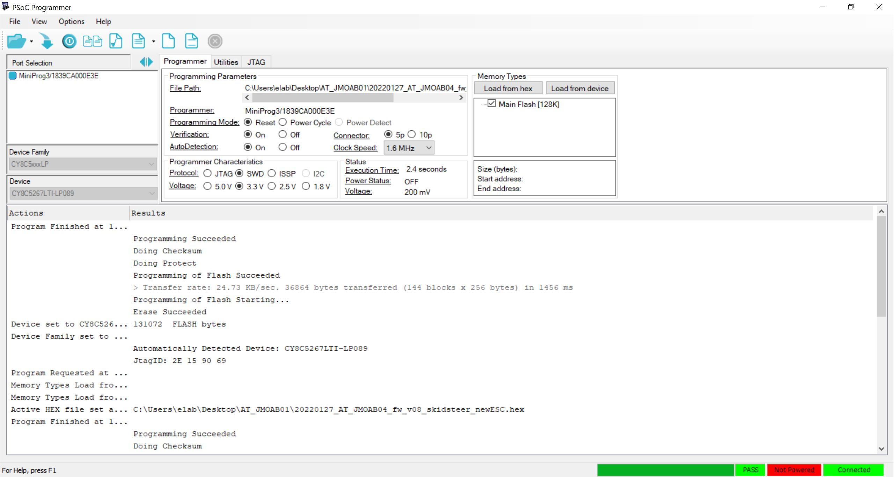
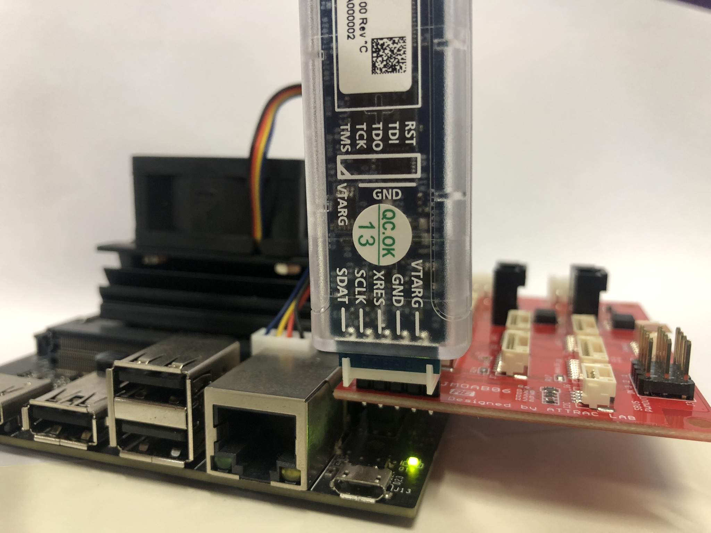
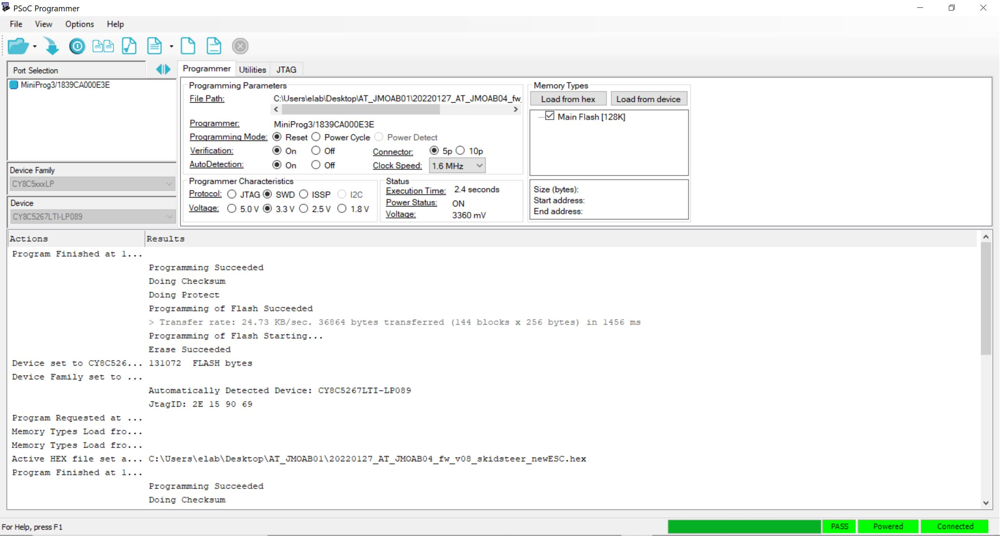
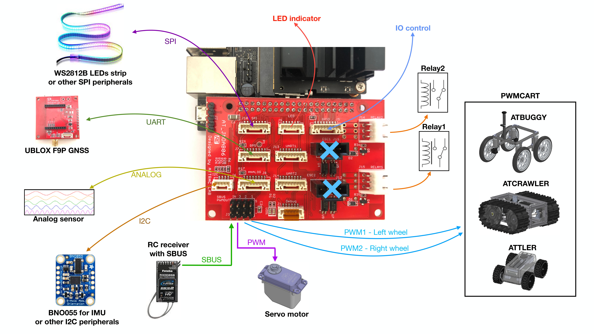
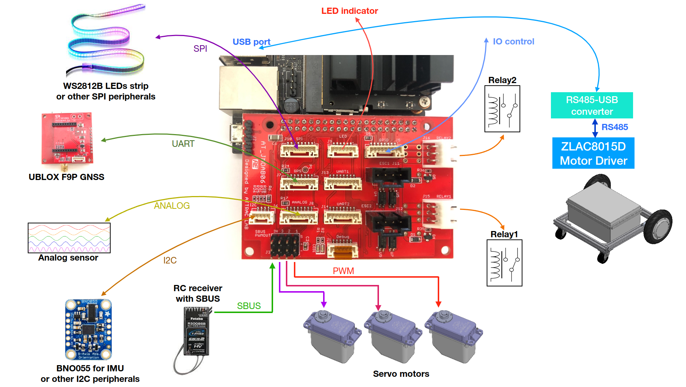

# JMOAB ROS2

JMOAB package for ROS2. This package is based on [jmoab-ros](https://github.com/rasheeddo/jmoab-ros) package from ROS1. The supported version of PCB is AT_JMOAB06.


## Dependencies

- ros2 debian packages, install from [here](https://docs.ros.org/en/foxy/Installation/Ubuntu-Install-Debians.html).
- `sudo pip3 install smbus2`
- `sudo apt install ros-$ROSDISTRO-tf-transformations`
- `sudo pip3 install transforms3d`
- `sudo pip3 install numpy`

Make sure to source all ros environment setup files.

`source /opt/ros/foxy/setup.bash` for Foxy.

`source ~/dev_ws/install/local_setup.bash` for local workspace name `dev_ws`.

## Update JMOAB firmware

All of available firmware are in [firmwares](./firmwares/) directory.

To flash the firmware, please follow the step below, (must use Windows PC)

- first you will need to have Mini Prog3 [programmer](https://www.digikey.com/catalog/en/partgroup/psoc-miniprog3-programmer-debugger-cy8ckit-002/20080).
- Download PSocC Programmer [software](https://www.infineon.com/cms/en/design-support/tools/programming-testing/psoc-programming-solutions/?utm_source=cypress&utm_medium=referral&utm_campaign=202110_globe_en_all_integration-product_families#!downloads).
- Open the PSoC Programmer, it will shown as here



- Keep eyes on lower right corner, so it should show 3 green as PASS, POWERED, Connected. So you should plug the Mini Prog3 to the JMOAB J2 header. Make sure that the VTARG pin of the programmer is on the correct pin header on JMOAB (most right pin when facing to Jetson USB port). And also please power on the Jetson as well.



- Once you saw all three greens status, the select which firmware you would like to use, and click on Program button right next to Open button.
- If it's success, you will see the it's showing successful message.



- You will need to power off and on the Jetson again to take affect of new firmware on JMOAB.

## JMOAB atcart_basic

To use JMOAB with ATCart, make sure to have the correct ESC FW by checking from [here](https://github.com/rasheeddo/BrushlessDriveWheels/tree/new-batch-esc#hack-new-batch-esc). The "Model" at the back of ESC should be "MN1 WSDC/3+7F&G-X". 

If you don't know what ATCart is, I recommend to check on [this site](https://stepbystep-robotics.com/hp/robots/atcart-overview/atcart-basic/) or [this video](https://www.youtube.com/watch?v=Y4HL69gDDOU&ab_channel=stepbystep-robotics) about how I hacked it and use it for robots project.

As default the JMOAB is pre-flashed with atcart functions firmware. You can check available firmwares from [firmwares directory](https://github.com/attraclab/jmoab_ros2/tree/master/firmwares), as default it is 20220322_JMOAB06_v1.hex

JMOAB itself can be connected with many peripherals,


You just need to run

`ros2 run jmoab_ros2 atcart_basic`

### publish

- `/jmoab/sbus_rc_ch` as std_msgs/msg/Int16MultiArray, sbus value of RC transmitter's channels
- `/jmoab/cart_mode` as std_msgs/msg/UInt8, 0: hold, 1: manual, 2: auto modes
- `/jmoab/adc` as std_msgs/msg/Float32MultiArray, ADC value in 12bits maximum voltage is 40.96V

### subscribe

- `/cmd_vel` as geometry_msgs/msg/Twist, you can consider linear.x as throttle (go straight), and angular.z as steering (turning). 
- `/jmoab/wheels_cmd` as std_msgs/msg/Float32MultiArray, this is percentage of left/right wheel power ex. [30.0, -50.0] is left wheel would be spinning forward 30% and right wheel would be spinning reverse 50% . This would be useful when you want to control each wheel speed individually.
- `/jmoab/cart_mode_cmd` as std_msgs/msg/UInt8, this allow you to change cart mode programmatically; 0: hold, 1: manual, 2: auto modes
- `/jmoab/relays` as std_msgs/msg/Int8MultiArray, you can control relays ON/OFF; ex. [1,0] relay1 on relay2 off.
- `/jmoab/servos` as std_msgs/msg/Int16MultiArray, you can control servo motors by pwm value; ex. [1920, 1120, 1520] servo1 is high, servo2 is low, servo3 is neutral.

## JMOAB bno055

Before running imu node, I recommend to do sensor calibration by going to [scripts directory](./scripts/) and run

`python3 bno055_calibrate.py`

You will need to follow these step

1. leave the sensor stays still on table to get gyroscope offset, make sure the `gyr_stat` becomes 3.
2. try put the sensor in 45, 90 -45, -90, -180 degrees to calibrate accelerometer and keep it stay still in each angle for few seconds, make sure the `acc_stat` becomes 3.
3. try swing the sensor into air to calibrate magnetometer, make sure the `mag_stat` becomes 3.
4. once all stat becames 3, the `sys_stat` should turn to 3 as well, then it will end the program by itself, sometimes I got all offset showing 0, you can try run the script again and it will just print the latest offset correctly.
5. You will get `calibration_offset.txt` file in `scripts/`, so keep it there. bno055.py will load this automatically.

After that you just run

`ros2 run jmoab_ros2 bno055`

### publish

- `/imu/data` as sensor_msgs/msg/Imu, all of data would be filled in the message, you can use this for EKF sensor fusion later.
- `/jmoab/ahrs` as std_msgs/msg/Float32MultiArray, the data is [roll, pitch, heading] in degrees 0-360 range.

### subscribe

- `/jmoab/sbus_rc_ch` as std_msgs/msg/Int16MultiArray, it will use throttle stick to recognize that user is moving the cart in straight line.
- `/jmoab/cart_mode` as std_msgs/msg/UInt8, it will calibrate the heading just only in manual control.
- `/fix` as sensor_msgs/msg/NavSatFix, to use GPS data as reference when it's moving in straight line then it will do heading calibration.

## JMOAB pwmcart

In case of other type of cart which needs PWM signal like regular RC car, we have to flash pwm-cart firmware from [firmwares directory](https://github.com/attraclab/jmoab_ros2/tree/master/firmwares), it is 20220729_AT_JMOAB06_fw_v09_PWM-ESC.hex . Please checking on update firmware from step above.

Similar to ATCart it could have other peripherals control, but instead of ATCart interface, it's using PWM1 for left wheel and PWM2 for right wheel ESCs. Vehicles such as ATBuggy, ATCrawler, or ATTLER could be used.



Then you just run

`ros2 run jmoab_ros2 pwmcart`

### publish

- `/jmoab/sbus_rc_ch` as std_msgs/msg/Int16MultiArray, sbus value of RC transmitter's channels
- `/jmoab/cart_mode` as std_msgs/msg/UInt8, 0: hold, 1: manual, 2: auto modes
- `/jmoab/adc` as std_msgs/msg/Float32MultiArray, ADC value in 12bits maximum voltage is 40.96V

### subscribe

- `/cmd_vel` as geometry_msgs/msg/Twist, you can consider linear.x as throttle (go straight), and angular.z as steering (turning). 
- `/jmoab/wheels_cmd` as std_msgs/msg/Float32MultiArray, this is percentage of left/right wheel power ex. [30.0, -50.0] is left wheel would be spinning forward 30% and right wheel would be spinning reverse 50% . This would be useful when you want to control each wheel speed individually.
- `/jmoab/cart_mode_cmd` as std_msgs/msg/UInt8, this allow you to change cart mode programmatically; 0: hold, 1: manual, 2: auto modes
- `/jmoab/relays` as std_msgs/msg/Int8MultiArray, you can control relays ON/OFF; ex. [1,0] relay1 on relay2 off.
- `/jmoab/servo` as std_msgs/msg/Int16, you can control only one servo motor by pwm value; ex. in 1120-1520-1920 ranges.

### Tips

It is necessary to know that how much of lowest speed each left/right motors can spin. So you can try to publish `/jmoab/wheels_cmd` little by little, for example,

`ros2 topic pub /jmoab/wheels_cmd std_msgs/msg/Float32MultiArray "data: [10.0, 10.0]"`

Then from RC transmitter (ch.5) switch to auto mode.

On `pwmcart` node termnial you will see log info every 1 second printing

```
[INFO] [1659088017.413651126] [jmoab_ros2_pwmcart]: vx: 0.00 wz: 0.00 left: 0.00 right: 0.00 x: 0.00 y: 0.00 l_sbus: 1024 r_sbus: 1024
[INFO] [1659088018.461170311] [jmoab_ros2_pwmcart]: vx: 0.00 wz: 0.00 left: 0.00 right: 0.00 x: 0.00 y: 0.00 l_sbus: 1024 r_sbus: 1024
[INFO] [1659088019.512736894] [jmoab_ros2_pwmcart]: vx: 0.00 wz: 0.00 left: 0.00 right: 0.00 x: 0.00 y: 0.00 l_sbus: 1024 r_sbus: 1024
[INFO] [1659088020.561640338] [jmoab_ros2_pwmcart]: vx: 0.00 wz: 0.00 left: 0.00 right: 0.00 x: 0.00 y: 0.00 l_sbus: 1024 r_sbus: 1024

```  

so observe that at which `/jmoab/wheels_cmd` value the wheels are almost not moving at all, left and right could be different values as well. Then check on `l_sbus` and `r_sbus` which printing out, so that is the upper deadband where the motors could start to spin forward.

Then put those value into the parameters file at [config/pwmcart_params.yaml](https://github.com/attraclab/jmoab_ros2/blob/master/config/pwmcart_params.yaml), at `sbus_left_max_db` and `sbus_right_max_db`.

Again try to publish `/jmoab/wheels_cmd` in reverse value like `[-10.0, -10.0]` and keep adjusting until the motors are mostly stop. Then put those values on `sbus_left_min_db` and `sbus_right_min_db`.

In order to use this parameters file, you need to run as

`ros2 run jmoab_ros2 pwmcart --ros-args --params-file ~/dev_ws/src/jmoab_ros2/config/pwmcart_params.yaml`

note that my workspace is `dev_ws`.

Then try publish `/jmoab/wheels_cmd` again, now even 1% or 2% you should notice that the wheel starts to spin slowly.

## JMOAB ATCart8

ATCart8 is an 8 inch encoder built-in wheel motor based platform.

You will need to install this [additiona python package](https://github.com/rasheeddo/ZLAC8015D_python) in order to run this. If you are able to run some examples in [ZLAC8015D_python/examples](https://github.com/rasheeddo/ZLAC8015D_python/tree/master/examples) and the motors can spin correctly then you can continue from this.



ATCart8 is not related JMOAB directly, but in case of some application which requires JMOAB then you can use this as well. 

You will need to make a udev rules, if you're using many USB serial ports in the same time, so in this case I made the USB-RS485 serial port as `/dev/usb_rs485`, so if you're using different name, you have to change it on [this line](https://github.com/attraclab/jmoab_ros2/blob/60af19e06cf2aa8087f8a06c9f12971f9462d050/jmoab_ros2/atcart8.py#L119).

### publish

- `/jmoab/sbus_rc_ch` as std_msgs/msg/Int16MultiArray, sbus value of RC transmitter's channels
- `/jmoab/cart_mode` as std_msgs/msg/UInt8, 0: hold, 1: manual, 2: auto modes
- `/jmoab/adc` as std_msgs/msg/Float32MultiArray, ADC value in 12bits maximum voltage is 40.96V
- `/jmoab/wheels_rpm` as std_msg/msg/Float32MultiArray, this is feedback RPM from ZLAC8015D driver [left_rpm, right_rpm].
- `/atcart8/odom` as nav_msgs/msg/Odometry, this is raw odometry from wheel's encoder calculation, you will need EKF node to run together to have better odometry.

### subscribe

- `/cmd_vel` as geometry_msgs/msg/Twist, you can consider linear.x as throttle (go straight), and angular.z as steering (turning). 
- `/jmoab/cart_rpm_cmd` as std_msgs/msg/Int16MultiArray, this is wheel's RPM control. 
- `/jmoab/cart_deg_cmd` as std_msgs/msg/Int16MultiArray, this is wheel's angle (degree) control, you only need to send one time (not continuously like cmd_vel).
- `/jmoab/cart_dist_cmd` as std_msgs/msg/Int16MultiArray, this is wheel's distance (meters) control, you only need to send one time (not continuously like cmd_vel).
- `/jmoab/cart_mode_cmd` as std_msgs/msg/UInt8, this allow you to change cart mode programmatically; 0: hold, 1: manual, 2: auto modes
- `/jmoab/relays` as std_msgs/msg/Int8MultiArray, you can control relays ON/OFF; ex. [1,0] relay1 on relay2 off.
- `/jmoab/servo` as std_msgs/msg/Int16, you can control only one servo motor by pwm value; ex. in 1120-1520-1920 ranges.
